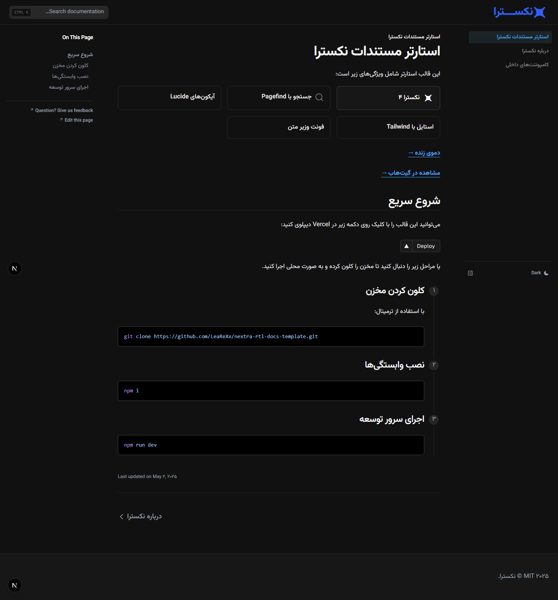

# Nextra RTL Docs Starter

This starter template includes the following features:

- [x] **Nextra 4**
- [x] **Next JS 15**
- [x] **Search with Pagefind**
- [x] **RTL Support**
- [x] **Tailwind Added**
- [x] **Lucide Icons**
- [x] **Vazirmatn Font**

[**Live Demo →**](https://nextra-rtl-docs-template.vercel.app/)



## Quick Start

You can deploy this template on Vercel by clicking the button below

[](https://vercel.com/new/clone?repository-url=https://github.com/LeaReXx/nextra-rtl-docs-template.git)

## Local Development

### Clone this repository

Using the Terminal:

```bash
git clone https://github.com/LeaReXx/nextra-rtl-docs-template.git
```

### Install

```bash
npm i
```

### Run the development server

```bash
npm dev
```

## License

This project is licensed under the MIT License.
